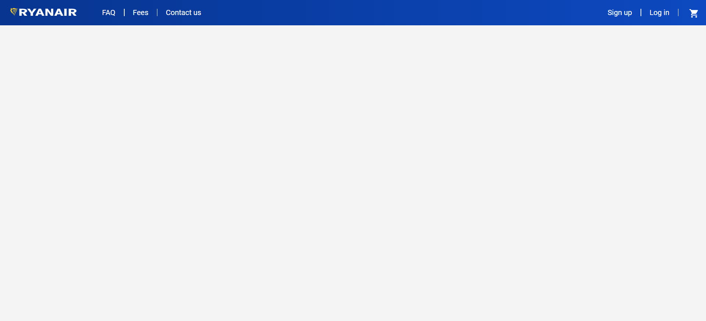

<a href="https://www.youtube.com/watch?v=YxbPm6CcVY0&t=2s">
    
</a>

# 💻 My Automation Project 
✅ This is a testing automation project that tests a real site called: 
<br>"Ryanair Automation Project"

## 📖 Overview

This repository contains a comprehensive automated testing project built with Java, Selenium and TestNG,. 
The project follows the Page Object Model (POM) design pattern for a modular and maintainable test suite.

<p>
    <h2> <b>Example for screenshot on failure</b></h2>
  
</p>

## 📑 Technologies & Skill & Features
| Technologies      | Description |
| ----------- | ----------- |
| **Java:**      | The project is developed using Java, providing a robust and widely used programming language for automation.       |
| **TestNG:**   | TestNG is used as the testing framework, offering powerful test configuration options, parallel execution, and detailed reporting.        |
| **Selenium WebDriver:**   | The project includes Selenium WebDriver for automating browser interactions        |
| **Page Object Model (POM):**   | The project follows the POM design pattern, enhancing test maintainability and reusability by separating page elements and actions.       


## 📖 Prerequisites

- Eclipse frame work.
- Selenuim library.
- TestNG library.

## 📁 Project Structure
```
├───ScreenShots
├───bin
│   ├───pageObject
│   └───pageTest
├───src
│   ├───pageObject
│   └───pageTest
└───test-output
    ├───Default suite
    ├───junitreports
    └───old
        └───Default suite
```

Thanks for visiting my GitHub profile! 😊
Ofir Adato

